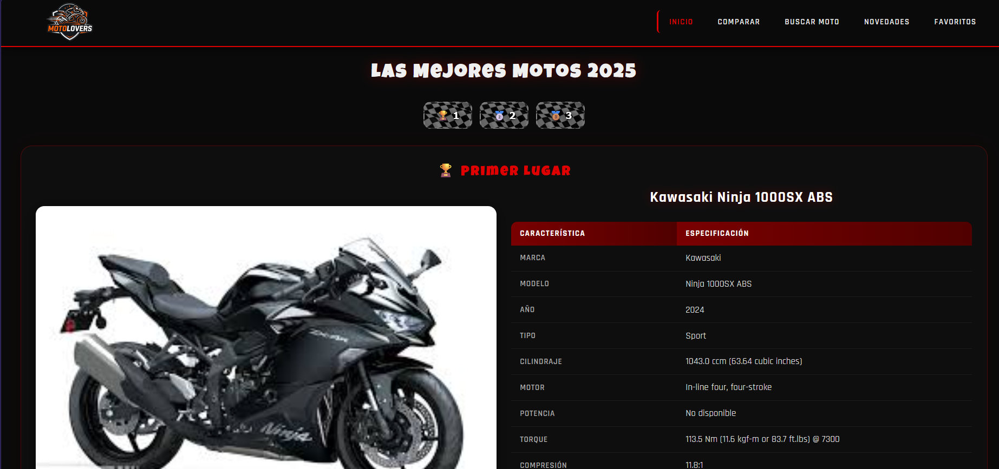
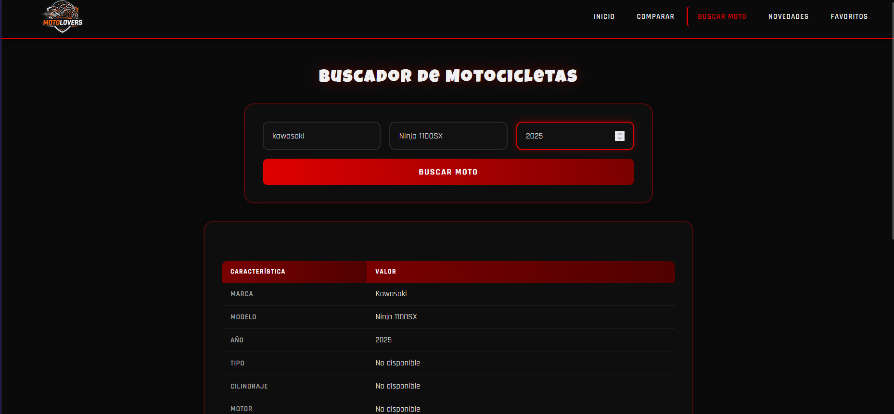
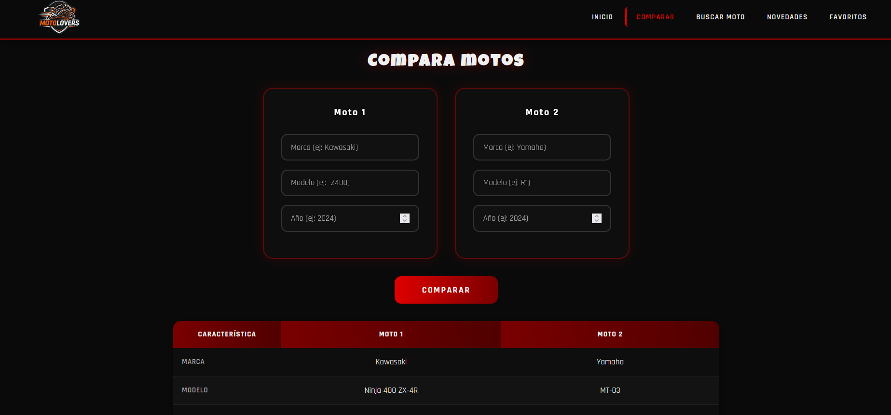
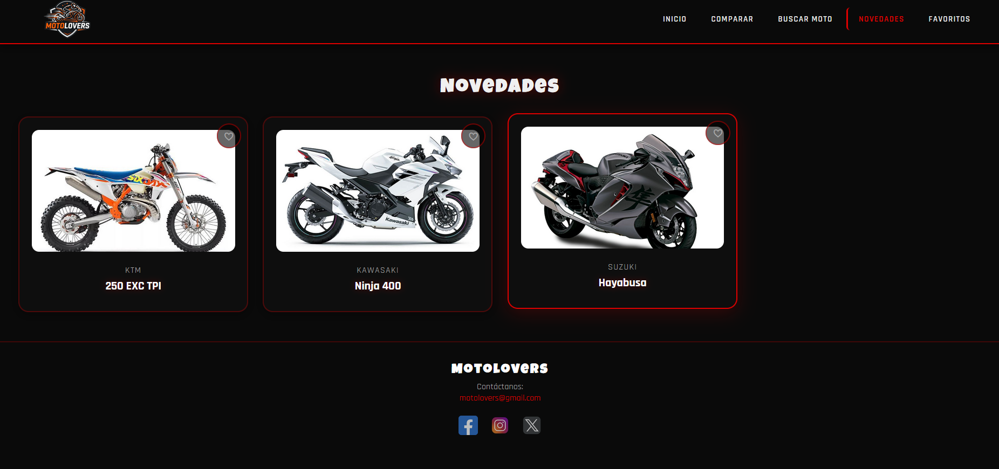
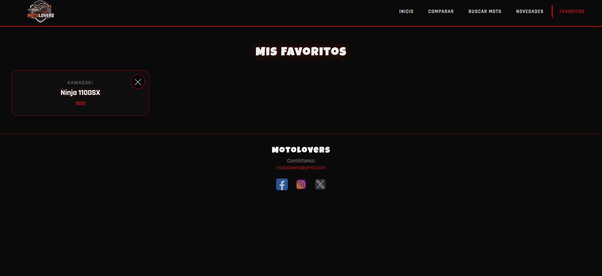
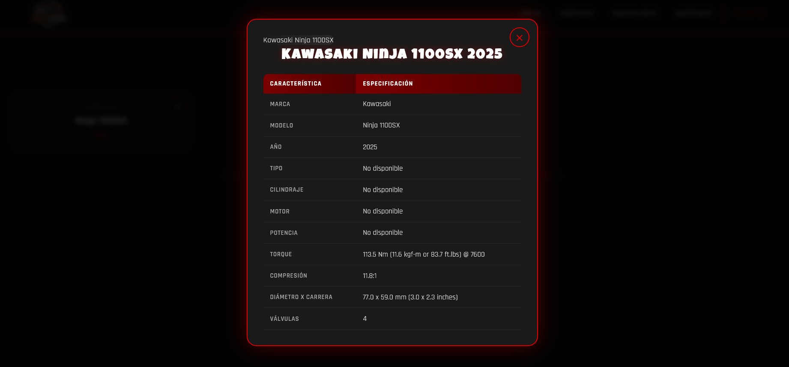

# MotoLovers 🏍️


Aplicación web para buscar, comparar y descubrir motocicletas de diferentes marcas y modelos. MotoLovers permite a los entusiastas de las motos explorar especificaciones técnicas, comparar modelos y guardar sus favoritos en una colección personal.

## 📑 Tabla de Contenidos

- [Características](#-características)
- [Tecnologías Utilizadas](#-tecnologías-utilizadas)
- [Requisitos Previos](#-requisitos-previos)
- [Instalación](#-instalación)
- [Estructura del Proyecto](#-estructura-del-proyecto)
- [Uso de la Aplicación](#-uso-de-la-aplicación)
- [Galería de Imágenes](#-galería-de-imágenes)
- [Configuración de la API](#-configuración-de-la-api)
- [Personalización](#-personalización)
- [Roadmap](#-roadmap)
- [Notas Importantes](#-notas-importantes)
- [Autor](#-autor)
- [Contacto](#-contacto)

## 🌟 Características

### 🔍 Buscador Avanzado
- **Búsqueda por marca, modelo y año**: Encuentra cualquier motocicleta específica
- **Resultados en tiempo real**: Datos obtenidos directamente de la API
- **Especificaciones detalladas**: Cilindraje, motor, potencia, torque y más
- **Sistema de favoritos integrado**: Guarda tus búsquedas favoritas con un clic

### ⚖️ Comparador Inteligente
- **Comparación lado a lado**: Visualiza diferencias entre dos motos
- **Tabla comparativa interactiva**: Formato fácil de leer
- **Limpieza automática**: Los campos se borran después de comparar
- **Especificaciones clave**: Compara los datos más importantes

### 🆕 Novedades del Mercado
- **Top 3 motos destacadas**: Las mejores motos del año 2025
- **Imágenes de alta calidad**: Visualiza cada modelo en detalle
- **Tarjetas interactivas**: Haz clic para ver especificaciones completas
- **Animaciones suaves**: Transiciones elegantes al cambiar de moto

### ❤️ Sistema de Favoritos
- **Colección personal**: Guarda tus motos favoritas
- **Persistencia local**: Tus favoritos se guardan en el navegador
- **Gestión fácil**: Agrega o elimina motos con un clic
- **Modal de detalles**: Visualiza especificaciones completas
- **Diseño limpio**: Tarjetas sin imagen para enfoque en datos

### 🎨 Diseño y UX
- **Interfaz moderna**: Tema oscuro con acentos rojos
- **Totalmente responsivo**: Funciona en móvil, tablet y desktop
- **Animaciones fluidas**: Transiciones suaves y profesionales
- **Spinner de carga**: Indicador visual mientras carga la página
- **Navegación intuitiva**: Menú hamburguesa para dispositivos móviles
- **Accesibilidad**: Etiquetas ARIA y estructura semántica

## 🛠️ Tecnologías Utilizadas

- **HTML5**: Estructura semántica del proyecto
- **CSS3**: Estilos modernos con variables CSS y diseño responsivo
- **JavaScript (ES6+)**: Lógica de la aplicación con módulos
- **API-Ninjas**: Fuente de datos de motocicletas
- **LocalStorage**: Persistencia de datos de favoritos

## 📋 Requisitos Previos

- Navegador web moderno (Chrome, Firefox, Safari, Edge)
- Conexión a internet (para acceder a la API de motocicletas)

## 🚀 Instalación

1. Clona el repositorio:
```bash
git clone https://github.com/tu-usuario/MotoLovers.git
```

2. Navega al directorio del proyecto:
```bash
cd MotoLovers
```

3. Abre el archivo `index.html` en tu navegador web preferido

No requiere instalación de dependencias ni servidor backend, es una aplicación estática que funciona directamente en el navegador.

## 📁 Estructura del Proyecto

```
MotoLovers/
├── css/
│   ├── style.css          # Estilos globales
│   ├── layout.css         # Layout y estructura
│   ├── inicio.css         # Estilos de página principal
│   ├── busqueda.css       # Estilos del buscador
│   ├── comparar.css       # Estilos del comparador
│   ├── novedades.css      # Estilos de novedades
│   └── favoritos.css      # Estilos de favoritos
├── js/
│   ├── motos.js           # Conexión con API de motos
│   ├── main.js            # Lógica de página principal
│   ├── buscar.js          # Lógica del buscador
│   ├── comparar.js        # Lógica del comparador
│   ├── novedades.js       # Lógica de novedades
│   └── favoritos.js       # Lógica de favoritos
├── img/
│   ├── Motoloveres_logo.png
│   ├── KTM_250_EXC_TPI.jpeg
│   ├── Kawasaki_ninja_400.jpg
│   └── Suzuki_hayabusa.png
├── icon/                  # Iconos de redes sociales
├── index.html             # Página principal
├── buscar_moto.html       # Página de búsqueda
├── comparaciones.html     # Página de comparación
├── novedades.html         # Página de novedades
├── favoritos.html         # Página de favoritos
└── README.md              
```

## 💡 Uso de la Aplicación

### Página Principal (INICIO)
- Muestra las motos más populares del mercado
- Navegación rápida a todas las secciones

### Buscador de Motos
- Ingresa la marca, modelo y año de la moto que buscas
- Visualiza especificaciones técnicas detalladas
- Agrega motos a tus favoritos con un solo clic

### Comparador de Motos
- Selecciona dos motos para comparar sus especificaciones
- Compara cilindraje, potencia, torque, motor y más
- Visualiza las diferencias en una tabla comparativa

### Novedades
- Descubre las motos más recientes del mercado
- Visualiza imágenes y especificaciones
- Agrega motos a tus favoritos

### Favoritos
- Accede a tu colección personal de motos
- Elimina motos que ya no te interesen
- Visualiza especificaciones completas en modal

## 📸 Galería de Imágenes

*Aquí puedes agregar capturas de pantalla de la aplicación en uso*

### Página Principal
<!-- Agrega imagen aquí -->


### Buscador de Motos
<!-- Agrega imagen aquí -->


### Comparador de Motos
<!-- Agrega imagen aquí -->


### Novedades
<!-- Agrega imagen aquí -->


### Favoritos
<!-- Agrega imagen aquí -->


### Presentación de detalles
<!-- Agrega imagen aquí -->



## 🔧 Configuración de la API

La aplicación utiliza la API de API-Ninjas para obtener datos de motocicletas. **La clave de API es privada y no debe ser compartida ni subida a repositorios públicos.**

### Configuración de la clave de API

1. **Obtén tu clave de API**:
   - Regístrate en [API-Ninjas](https://api-ninjas.com/)
   - Obtén tu clave de API para el endpoint de motocicletas

2. **Configura la clave de API**:
   - Crea un archivo llamado `config.js` en la carpeta `js/`
   - Agrega tu clave de API de la siguiente manera:

```javascript
// js/config.js
export const API_KEY = "TU_CLAVE_DE_API_AQUI";
```

3. **Asegura tu clave de API**:
   - El archivo `config.js` está incluido en `.gitignore` para proteger tu clave
   - Nunca compartas tu clave de API ni la subas a repositorios públicos
   - Para producción, considera usar variables de entorno o un servidor proxy

**⚠️ IMPORTANTE**: La clave de API es información sensible. Manténla segura y no la compartas públicamente.

## 🎨 Personalización

### Colores
Puedes personalizar los colores de la aplicación modificando las variables CSS en `css/style.css`:

```css
:root {
    --rojo-principal: #e00000;
    --rojo-oscuro: #8b0000;
    --rojo-glow: rgba(224, 0, 0, 0.5);
    /* ... más variables */
}
```

### Imágenes
Las imágenes de las motos se encuentran en la carpeta `img/`. Puedes agregar o reemplazar las imágenes según tus necesidades.

## 📝 Notas Importantes

- La aplicación requiere conexión a internet para funcionar correctamente
- Los datos de motocicletas se obtienen en tiempo real de la API
- Los favoritos se guardan en el localStorage del navegador
- La compatibilidad con navegadores antiguos puede ser limitada

## 🗺️ Roadmap

### ✅ Versión 1.0 - Completada
- [x] Página principal con Top 3 motos
- [x] Buscador de motocicletas
- [x] Comparador de motos
- [x] Página de novedades
- [x] Sistema de favoritos
- [x] Diseño responsivo
- [x] Animaciones y transiciones
- [x] Spinner de carga

### 🚧 Versión 1.1 - En Desarrollo
- [ ] Sistema de filtros avanzados en novedades
- [ ] Ordenamiento de resultados
- [ ] Modo oscuro/claro
- [ ] Compartir favoritos
- [ ] Exportar comparación a PDF


## 🙏 Agradecimientos

- API-Ninjas por proporcionar la base de datos de motocicletas

## 👥 Autor

- Alan Gómez - Programador Full Stack jr.

- **Email**: motolovers@gmail.com
- **Redes Sociales**:
  - [GitHub](https://github.com/AlanGomez-Programmer)
  - [Linkedln](alan-gomez-763163320)


---

**¡Disfruta explorando el mundo de las motocicletas con MotoLovers!** 🏍️✨
